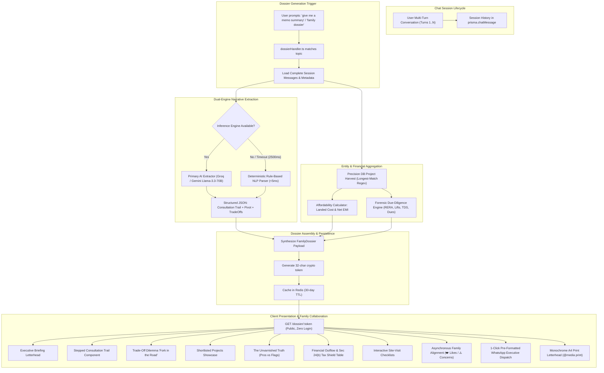

# PropFyndr Consultation Dossier & Narrative Memory Engine
## Master Architectural Specification & Execution Blueprint

**Document Version:** 1.0.0  
**Target Milestone:** Day 7 Master Advisory Evolution  
**Governing Design Systems:** [docs/appleDESIGN.md](file:///c:/Users/Furqan/Desktop/RealtyPals/docs/appleDESIGN.md) & [docs/master-design-engineering-skill.md](file:///c:/Users/Furqan/Desktop/RealtyPals/docs/master-design-engineering-skill.md)  
**Target Modules:**  
- `backend/src/lib/chat/handlers/dossierHandler.ts`
- `backend/src/lib/chat/dossierNarrativeExtractor.ts`
- `backend/src/routes/dossier.ts`
- `frontend/app/dossier/[token]/page.tsx`
- `frontend/components/chat/DossierShareCard.tsx`

---

## 1. Executive Summary & Problem Diagnosis

### 1.1 The Fundamental Flaw of Traditional Property Dossiers
Traditional real estate platforms and generic AI wrappers treat property summaries as static product catalogs. When a buyer requests a summary or a dossier, the system merely displays brochures of whichever properties were mentioned in the final turn.

This model is completely divorced from how real families make multi-crore property purchase decisions:
* Property research is **exploratory, iterative, and non-linear**.
* A buyer investigates multiple sectors, tests configurations, rules out developers, pivots to other micro-markets due to pricing, and conducts deep forensic checks (water quality, lift safety, Authority land dues, and court receiver delays).
* When that buyer forwards a link to their spouse, parent, or legal counsel, **the family was not present during the chat**. A static list of cards does not explain **why** these homes were shortlisted or **what** trade-offs were investigated.

### 1.2 The Archetypal Buyer Scenario (The Benchmark Test Case)
A real buyer session unfolds across 4 to 8 conversational turns:
```text
Turn 1: Buyer inquiries about Sector 76 Noida (wants 3 BHK near the metro station under ₹2 Cr).
        AI analyzes Sector 76: mature location, 5-min walk to metro, but average prices exceed ₹1.85–2.4 Cr.
Turn 2: Buyer checks Amrapali Silicon City in Sector 76 for affordability.
        AI warns of Supreme Court receiver delivery: physically built, but sub-lease registry token execution is staggered.
Turn 3: Buyer pivots: "Can we get more carpet area and newer construction in Sector 10 Greater Noida West?"
        AI validates Sector 10: yields +30% larger carpet area for ₹1.1–1.5 Cr, but notes dependence on borewell water.
Turn 4: Buyer asks about Elite X vs Nirala Diadem in Sector 10: check construction quality, water TDS, and UP Lifts Act.
        AI audits: Elite X has 0 pending land dues under Amitabh Kant formula; Nirala closer to high-street retail.
Turn 5: Buyer asks: "Give me a family memo dossier summarizing our entire conversation."
```

### 1.3 The Mission of This Engine
The **Consultation Dossier & Narrative Memory Engine** transforms the dossier into an authentic, narrative consultation artifact:
1. **Consultation Trail:** Every single question the buyer asked is recorded in $\le 15$ plain-English words alongside a $\le 25$ word ground-reality verdict.
2. **Sector & Strategy Pivot Tracking:** Explicitly tags and explains why the buyer pivoted (e.g. from Sector 76 Noida to Sector 10 Gr. Noida West).
3. **The "Fork in the Road" Trade-Off Matrix:** A high-level contrast summarizing the central decision dilemma.
4. **Institutional Apple Design Presentation:** Built in strict conformance with Apple's typography, parchment surface hierarchy, and anti-nesting rules.
5. **1-Click WhatsApp Executive Rich Card & Family Alignment:** Formatted multi-point WhatsApp message dispatch with asynchronous family reaction voting.

---

## 2. End-to-End System Architecture



---

## 3. Data Contracts & Type Definitions

### 3.1 Extended Dossier Schema (`backend/src/routes/dossier.ts` & `dossierHandler.ts`)

```typescript
export type ConsultationBadge = 
  | 'SECTOR_PIVOT' 
  | 'LEGAL_CHECK' 
  | 'BUDGET_TEST' 
  | 'WATER_AUDIT' 
  | 'VERTICAL_TRANSIT' 
  | 'PROJECT_DEEP_DIVE'

export interface ConsultationStep {
  step: number
  sectorOrTopic: string
  userQuestion: string          // Max 15 words: plain, simple buyer inquiry
  groundRealityVerdict: string  // Max 25 words: unvarnished factual finding
  badge?: ConsultationBadge
}

export interface TradeOffDilemma {
  optionA: {
    name: string
    advantage: string
    drawback: string
  }
  optionB: {
    name: string
    advantage: string
    drawback: string
  }
  verdictRecommendation: string
}

export interface DossierFinancials {
  basePriceCr: number
  landedCostCr: number
  downpaymentCr: number
  loanCr: number
  standardEmi: number
  taxShieldMonthly: number
  netMonthlyEmi: number
  safeMonthlyIncome: number
}

export interface DossierProjectItem {
  id: string
  name: string
  slug: string
  sector: string
  builderName: string | null
  status: string
  possessionLabel: string | null
  priceRangeLabel: string | null
  priceMinCr: number | null
  heroImageUrl: string | null
  strengths: string[]
  redFlags: string[]
  financials: DossierFinancials
  siteVisitChecklist: string[]
}

export interface FamilyDossier {
  token: string
  createdAt: string
  expiresAt: string
  consultation: {
    buyerName: string
    date: string
    targetSector?: string
    targetBhk?: string | number
    budgetLabel?: string
    notes?: string
    searchEvolutionSummary?: string // 2-sentence executive summary of the journey
  }
  consultationTrail: ConsultationStep[]
  tradeOffDilemma?: TradeOffDilemma | null
  projects: DossierProjectItem[]
  familyReactions?: Record<string, { likes: number; concerns: string[] }>
}
```

---

## 4. Multi-Turn Narrative Extraction Pipeline

### 4.1 Module: `backend/src/lib/chat/dossierNarrativeExtractor.ts`

The narrative extractor ingests the raw conversation transcript and produces the structured `consultationTrail` and `searchEvolutionSummary`.

#### Execution Logic:
1. **Message Pre-Processing:**
   - Filters out non-informative turns (`"hi"`, `"thanks"`, `"ok"`, `"share dossier"`).
   - Pairs each user query with the corresponding assistant answer.
2. **Sector Pivot Identification:**
   - Tracks unique sectors mentioned sequentially.
   - If Sector $B \neq$ Sector $A$, inspects the user's prompt for pivot reasoning (`"too expensive"`, `"more space"`, `"larger carpet"`, `"better connectivity"`).
3. **Primary Inference Prompt (Structured JSON):**
   ```text
   SYSTEM PROMPT:
   You are an institutional real estate consultation recorder for PropFyndr.
   Given the chronological buyer consultation messages, produce a JSON object with:
   1. "searchEvolutionSummary": 2 concise sentences explaining the buyer's search progression and key pivot.
   2. "consultationTrail": An array of steps (3 to 6 max). Each step MUST contain:
      - "step": Integer sequence starting at 1.
      - "sectorOrTopic": Sector or topic name (e.g., "Sector 76 Noida", "Water Quality", "Elite X").
      - "userQuestion": Plain-English question asked by buyer (MAX 15 WORDS).
      - "groundRealityVerdict": Factual, unvarnished finding found in the chat (MAX 25 WORDS).
      - "badge": One of ["SECTOR_PIVOT", "LEGAL_CHECK", "BUDGET_TEST", "WATER_AUDIT", "VERTICAL_TRANSIT", "PROJECT_DEEP_DIVE"].
   3. "tradeOffDilemma": (Optional) If the user evaluated two distinct areas or competing properties, define Option A vs Option B with 1 advantage and 1 drawback each, plus a 1-sentence verdict.
   ```
4. **Deterministic Fail-Safe (Zero-Token Fallback):**
   If the LLM key is cooled down, fails, or exceeds the `2,500ms` deadline:
   - Scans user prompts for question patterns (`"what about"`, `"is it safe"`, `"how is"`, `"tell me about"`).
   - Maps detected entities to catalog sectors and projects.
   - Extracts the first sentence of the assistant's response as the `groundRealityVerdict`.
   - Guaranteed completion in $<5\text{ms}$ with zero downtime.

---

## 5. Apple Design System & Visual Engineering

Adhering strictly to [docs/appleDESIGN.md](file:///c:/Users/Furqan/Desktop/RealtyPals/docs/appleDESIGN.md) and [docs/master-design-engineering-skill.md](file:///c:/Users/Furqan/Desktop/RealtyPals/docs/master-design-engineering-skill.md):

### 5.1 Color Tokens & Material System

| Token | Light Value | Dark Value | Purpose |
|---|---|---|---|
| **Canvas** | `#f5f5f7` (Parchment) | `#000000` (Deep Black) | Base page canvas |
| **Surface** | `#ffffff` (Pearl White) | `#1c1c1e` (Tile Surface) | Card and container surfaces |
| **Subtle Surface** | `#fafafc` | `#242426` | Metric cells & inner containers |
| **Hairline Border** | `#e5e5ea` (1px solid) | `#2c2c2e` (1px solid) | Crisp divider boundaries |
| **Action Blue** | `#0066cc` | `#2997ff` | Interactive controls, badges, and links |
| **Verified Green** | `#34c759` (`#28a745` text) | `#30d158` | Verified strengths, net EMI, and checkmarks |
| **Caution Amber** | `#ff9500` (`#d97706` text) | `#ff9f0a` | Forensic red flags and audit alerts |
| **Primary Ink** | `#1d1d1f` | `#f5f5f7` | Headlines, primary data, and emphasis |
| **Muted Ink** | `#86868b` | `#86868b` | Secondary labels, timestamps, and captions |

### 5.2 The 5 Core Visual Layout Rules
1. **Zero Decorative Neon Gradients:** Discard all blue/purple/indigo glowing blobs and blurred circles. Quality is conveyed through museum-gallery clarity, whitespace, and typographic contrast.
2. **"Not Everything is a Card" (Anti-Nesting):** Avoid nesting cards within cards. Section 2 (Pros vs Red Flags) uses a clean two-column split with hairline borders rather than heavy colored backgrounds.
3. **SF Pro Typography & Tracking:** Display titles use `-0.025em` tight tracking (`tracking-tight`). Financial values strictly employ `tabular-nums` for vertical column alignment.
4. **Continuous Squircles:** Border radii follow Apple standard `rounded-2xl` (16px), `rounded-[20px]`, `rounded-[24px]`, and `rounded-full`.
5. **Print Letterhead Parity:** `@media print` eliminates the floating navigation bar, shadows, and interactive toggles, outputting an executive monochrome letterhead formatted for A4 PDF export.

---

## 6. Page Structure & Component Breakdown

### 6.1 Floating Frosted Action Bar
* Sticky header with `backdrop-blur-xl bg-white/85 dark:bg-[#161617]/85 border-b border-[#e5e5ea] dark:border-[#2c2c2e]`.
* Brand icon with Action Blue accent.
* Action cluster:
  * **Print / PDF:** Invokes `window.print()` with print styles.
  * **Copy Link:** Copies URL to clipboard with 2.5s visual state change (`Link Copied!`).
  * **WhatsApp:** Dispatches formatted multi-point consultation brief.
  * **Return to Chat:** Links back to active session.

### 6.2 Executive Briefing Letterhead
* Confidential briefing pill: `Lock` icon, `REF #TOKEN`, date prepared, and buyer name.
* Title: `Family Property Consultation Dossier`.
* 4-metric executive scope strip:
  1. **Target Area:** Clean, combined sector string (e.g., *Sector 76 & Sector 10*).
  2. **Configuration:** Detected layout preference (e.g., *3 BHK Layout*).
  3. **Budget Bracket:** Dynamic price span from shortlisted projects (e.g., *₹1.08 – 2.07 Cr*).
  4. **Shortlisted Homes:** Total project count (e.g., *2 Verified Projects*).

### 6.3 The Stepped Consultation Trail (New Component)
* Placed directly below the Executive Letterhead.
* Renders each `ConsultationStep` in sequence:
  * Left: Stepped circular badge with step number and category pill (`SECTOR_PIVOT`, `LEGAL_CHECK`, etc.).
  * Center:
    * **What You Explored:** Plain-English buyer question in `#1d1d1f` ink.
    * **Ground Reality Finding:** Factual verdict in `#515154` ink.
* Sector Pivot Banner: When a strategic shift occurs, highlights the pivot reasoning with a subtle pearl container.

### 6.4 The "Fork in the Road" Trade-Off Matrix (New Component)
* Visual side-by-side comparison between the two primary directions explored (e.g., Sector 76 Noida Core vs Sector 10 Gr. Noida West).
* Clear 3-part layout:
  * **Option A:** Name, verified advantage, accepted compromise.
  * **Option B:** Name, verified advantage, accepted compromise.
  * **Executive Verdict:** 1-sentence recommendation based on buyer's stated priorities.

### 6.5 Shortlisted Projects Showcase
* Responsive dynamic grid:
  * 4 Projects: `grid-cols-1 sm:grid-cols-2 lg:grid-cols-4`
  * 3 Projects: `grid-cols-1 md:grid-cols-2 lg:grid-cols-3`
  * 2 Projects: `grid-cols-1 md:grid-cols-2`
* Architectural photo container with 16:10 aspect ratio and inner hairline ring.
* Floating badges for builder name and RERA possession status.
* Pricing strip: Base Price, Possession, Est. True Landed Cost (+28–30%), and Net Monthly EMI with Apple Green accent.
* Direct "Explore" link opening property page in new tab.

### 6.6 The Unvarnished Truth: Pros vs Forensic Red Flags
* For each project:
  * Clean two-column split:
    * **The Good (Verified Advantages):** Municipal Ganga Jal water, Amitabh Kant dues clearance, UP Lifts Act 2024 compliance, and builder delivery track record.
    * **The Bad (Forensic Red Flags & Cautions):** Unsettled Authority dues, borewell TDS readings (>800 ppm), Shahdara drain corridor proximity (<500m), and statutory cost loading.

### 6.7 Financial Outflow & Tax Shield Table
* Tabular financial model:
  1. Base Price
  2. True Landed Cost (includes 7% UP Stamp Duty, 5% GST, IFMS, meter charges)
  3. Downpayment (20%)
  4. Bank EMI (Gross @ 8.5% p.a. for 20 years)
  5. Sec 24(b) Monthly Tax Shield (₹2 Lakh annual deduction under old regime)
  6. **Net Monthly Outflow** (highlighted column with Apple Green accent)
  7. Safe Monthly Take-Home Income (adhering to 40% debt-to-income ceiling)
* Footnote explaining legal and tax calculation methodology.

### 6.8 Family Site-Visit & Negotiation Checklist
* 4 tailored questions per project to ask the sales office before issuing any token cheque:
  * 25% Authority dues challan deposit receipt.
  * UP Lifts Act 2024 registration certificate.
  * Water STP/RO test report with TDS readings.
  * Sanction architectural blueprints for usable carpet verification.
* Interactive checkboxes with tactile strikethrough state transitions.
* "Copy Questions for WhatsApp" button with instant feedback.

### 6.9 Family Asynchronous Alignment & Reactions
* Lightweight reaction chips on each project card:
  * ❤️ **Align / Like:** Tap to register approval.
  * ⚠️ **Flag Concern:** Tap to record hesitation.
* Communicates asynchronously via `POST /api/v1/dossier/:token/react`, persisting reactions in Redis.

---

## 7. 1-Click WhatsApp Executive Rich Card Specification

### 7.1 Dispatch Payload Structure
When the user taps the WhatsApp share button, the handler builds a rich markdown message:

```text
🏡 *PropFyndr Family Property Briefing — Executive Due-Diligence Dossier*

📋 *Our Consultation Trail:*
• Inquired: Sector 76 Noida ➔ Metro access confirmed, but 3 BHK prices average ₹1.85 Cr+
• Strategic Pivot: Sector 10 Gr. Noida West ➔ +30% larger carpet area under ₹1.5 Cr
• Water Check: Elite X groundwater TDS ~800 ppm; RO required until Ganga Jal pipeline

🏆 *Shortlisted Contenders:*
1. *Elite X* (Sector 10): ₹1.08–2.07 Cr | Landed ₹1.4 Cr | Net EMI ₹92,274/mo
2. *Nirala Diadem* (Sector 10): ₹1.45–2.85 Cr | Landed ₹1.89 Cr | Net EMI ₹1,25,668/mo

⚖️ *The Central Trade-Off:*
Mature Metro Core (Sector 76) vs +30% More Space & Modern Construction (Sector 10)

⚠️ *Top Forensic Caution:*
Verify Authority 25% dues deposit challan receipt before issuing any token payment.

📄 *Full Family Dossier, Financials & Site-Visit Checklists:*
👉 https://propfyndr.in/dossier/9c63257c
```

---

## 8. Verification & Quality Gates

Run this test matrix prior to declaring Day 7 complete:

| Test ID | Test Category | Target Assertion | Method |
|---|---|---|---|
| **T7.1** | **Multi-Turn Narrative Extraction** | 6-turn chat generates $\ge 3$ sequential consultation steps with correct sector pivot tagging. | `npm run test:dossier:narrative` |
| **T7.2** | **Conciseness Enforcement** | All `userQuestion` $\le 15$ words; all `groundRealityVerdict` $\le 25$ words. | Automated string length assertion in test runner |
| **T7.3** | **Zero-Latency Fallback** | Deterministic parser completes in $<10\text{ms}$ with 0 LLM tokens billed when API keys are disabled. | Simulated API timeout unit test |
| **T7.4** | **Trade-Off Dilemma Synthesis** | Detects multi-sector discussion and outputs structured Option A vs Option B contrast. | Integration test in `dossierHandler.test.ts` |
| **T7.5** | **WhatsApp Rich Card Formatting** | Generated WhatsApp text matches strict 5-part executive card format with valid URL. | Snapshot test on `handleShareWhatsApp` |
| **T7.6** | **Family Reactions Persistence** | `POST /dossier/:token/react` persists likes/concerns in cache and updates UI. | API endpoint test |
| **T7.7** | **TypeScript Typecheck** | Backend & frontend compile cleanly with 0 type errors. | `npx tsc --noEmit` on both workspaces |
| **T7.8** | **Apple Visual QA & Print Audit** | SF Pro typography, negative letter-spacing, hairline borders, clean A4 print format. | Headless browser screenshot verification |

---

## 9. File & Module Inventory

```text
RealtyPals/
├── docs/
│   └── planning/
│       ├── DAY_7_CONSULTATION_INTELLIGENCE_PLAN.md   <-- High-level execution roadmap chapter
│       └── CONSULTATION_DOSSIER_MASTER_SPEC.md       <-- THIS DOCUMENT: Complete master blueprint
├── backend/
│   └── src/
│       ├── lib/
│       │   └── chat/
│       │       ├── handlers/
│       │       │   ├── dossierHandler.ts             <-- Extended with narrative extraction & tradeoffs
│       │       │   └── __tests__/
│       │       │       └── dossierHandler.test.ts    <-- Multi-turn test suite
│       │       └── dossierNarrativeExtractor.ts      <-- Dual-engine narrative & pivot parser
│       └── routes/
│           └── dossier.ts                            <-- Extended API with reaction endpoints
└── frontend/
    └── app/
        └── dossier/
            └── [token]/
                └── page.tsx                          <-- Apple-styled consultation trail & dossier
```
